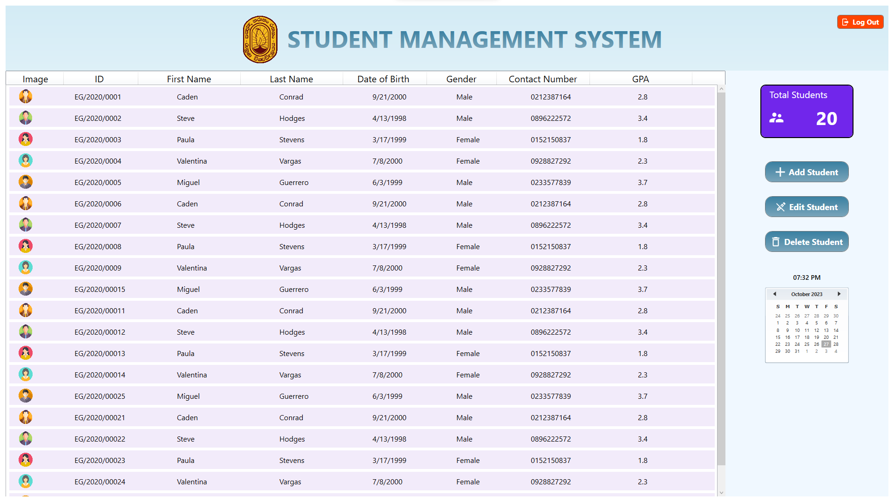

# Student Management Application

## Overview

This is a simple desktop application developed in WPF (Windows Presentation Foundation) for managing student data. It allows you to add, edit, and delete student records. The application follows the MVVM (Model-View-ViewModel) architecture and uses a user-friendly interface with styled controls.

## Features

- Display a list of student records with details like First Name, Last Name, Date of Birth, GPA, and an image thumbnail.
- Add a new student record with all necessary details.
- Edit an existing student record.
- Delete a student record.
- Utilizes MVVM architecture for efficient data management and separation of concerns.

## Prerequisites

- Windows operating system.
- .NET Framework 

## Installation

1. Clone or download the repository.
2. Open the solution in Visual Studio.
3. Build and run the application.

## Usage

1. Launch the application.
2. The main window will display the list of students.
3. Click the "Add Student" button to add a new student and provide all the necessary details.
4. Click the "Edit Student" button to edit the selected student's details.
5. Click the "Delete Student" button to delete the selected student.

## Contributing

Contributions are welcome! If you would like to contribute to this project, please follow these steps:

1. Fork the repository.
2. Create a new branch for your feature or bug fix.
3. Make your changes and commit them.
4. Submit a pull request to the main repository's `main` branch.
